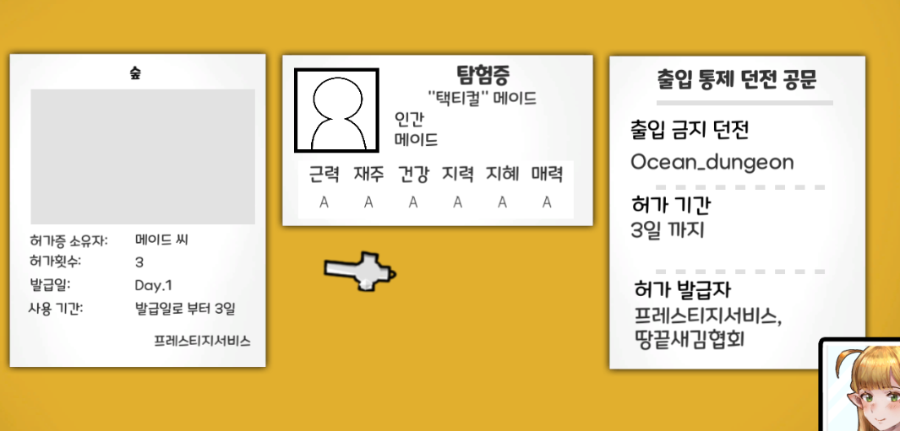
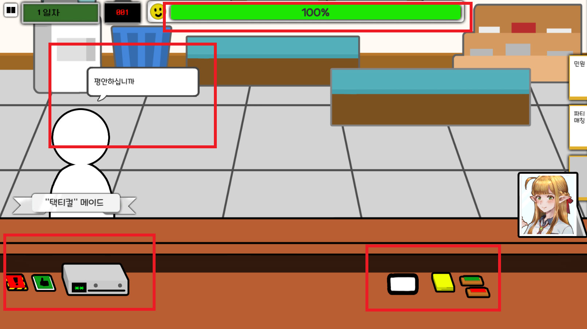
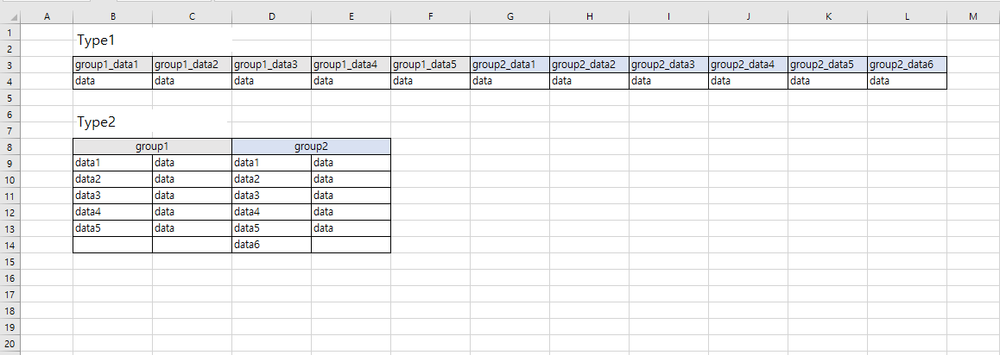

### 소개
이세계의 동사무소를 운영하는 액션 퍼즐게임(2D)

### 팀 구성
* 6인으로 구성
* 팀장 1명, 기획자 2명, 프로그래머 2명, 아트 1명
* 프로그래머로 참여

### 기술
Unity(C#), Python 3.x, Json, csv

### 설명
- Unity 엔진을 이용해 개발하고 있습니다.
- 다른 프로그래머와 기능별로 분담하여 개발하고 있습니다.
- 기획자들과 협업을 위해 대사 스크립트나 케릭터 정보들을 csv로 받고 json으로 변환시키는 python 스크립트를 작성하였습니다.

## 구현내용
게임이 주로 마우스를 사용하여 조작되므로 UGUI를 적극활용하여 개발하고 있습니다.


RectTransform의 AnchorPresets를 적극 활용해 추후 다양한 해상도 지원에 용이하도록 배치하고 있습니다.



게임에서 주로 다룰 작업물을 구현하였는데 task라는 부모 클래스를 두어 도장, 스티커 붙이기 등 도구와 상호작용을 할 수 있게하여 사용자의 실수를 유도해 게임의 난이도를 높히고  completeCheck 같은 가상 함수를 두어 제대로 작업을 했는지 체크합니다.




이 외로 Scene 대화 시스템, 인게임내 대화 시스템, Progress Bar, 작업도구, 인 게임 처리, json으로 민원인 구성 등 구현하였습니다.

## csv -> json python 스크립트 작성
csv보다는 추후에 확장성있는 json으로 채택을 하였고 그 동안은 기획자들에게 엑셀로 작성된 데이터들을 받아 일일히 작성하였으나
케릭터 정보, 대화 스크립트 등 양이 많아지면서 자동화의 필요성을 느끼게 되었습니다.

코드를 가장 빨리 작성할 수 있는게 무엇일까 생각했는데 python이 떠올라 python으로 빠르게 개발하였습니다.

```python
os.makedirs('./json', exist_ok=True)

fileName = input('파일이름 입력 >> ')
print(f'[{fileName}] 민원인 csv 변환중')

converter(fileName)
```
스크립트가 위치한 곳에 csv파일을 넣어두고 파일명을 입력하면 현재폴더의 json이라는 하위폴더에 변환된 json파일을 생성해 줍니다.

```python
코드 예)

import os
import csv
import json
import enum

class ValueType(enum.Enum):
	NORMAL=0 
	ARRAY=1

infoArrayGroup = ['request']
visaArrayGroup = ['admissionSymbol']

# 그룹의 key의 value의 데이터 타입을 판단합니다.
def valueTypeCheck(groupKey, key):
  valueType = ValueType.NORMAL
  if groupKey == 'info':
    if key in infoArrayGroup:
      valueType = ValueType.ARRAY
  elif groupKey == 'visa':
    if key in visaArrayGroup:
      valueType = ValueType.ARRAY

  return valueType

def converter(fileName):
  exportData = {}
  with open(f'{fileName}.csv', "r", encoding="utf-8-sig", newline="") as csvFile:
    
    reader = csv.reader(csvFile)
    columns = next(reader)

    for groupKey in columns:
      if groupKey != '':
        exportData[groupKey] = {}

    for col in reader:
    ...
```
내장 라이브러리로 os, csv, json 이 제공되어 쉽고 빠르게 개발할 수 있었습니다.



데이터를 작성할때 사진의 Type1보다는 Type2가 파악하기 쉽고 보기가 좋으므로 기획자들이 Type2로 데이터를 작성하고 변환할 수 있게 작성했습니다. 

사진의 Type2로 csv를 작성하고 변환을 하면 아래와 같이 변환이 됩니다.
```json
"group1": {
    "data1": data,
    "data2": data,
    "data3": data,
    "data4": data,
    "data5": data
},
"group2": {
    "data1": data,
    "data2": data,
    "data3": data,
    "data4": data,
    "data5": data,
    "data6": data
}
```

### 다음 개발 목표는

기획자 측면에서 command-line 환경에서 python 실행이 다소 어려울 수 있기에 윈도우 응용프로그램화를 할 예정이고 변환된 json이 제대로 동작하는지 테스트 해볼 수 있게 로컬에서 돌리는 스크립트 테스트 웹페이지를 개발해보려고 합니다.