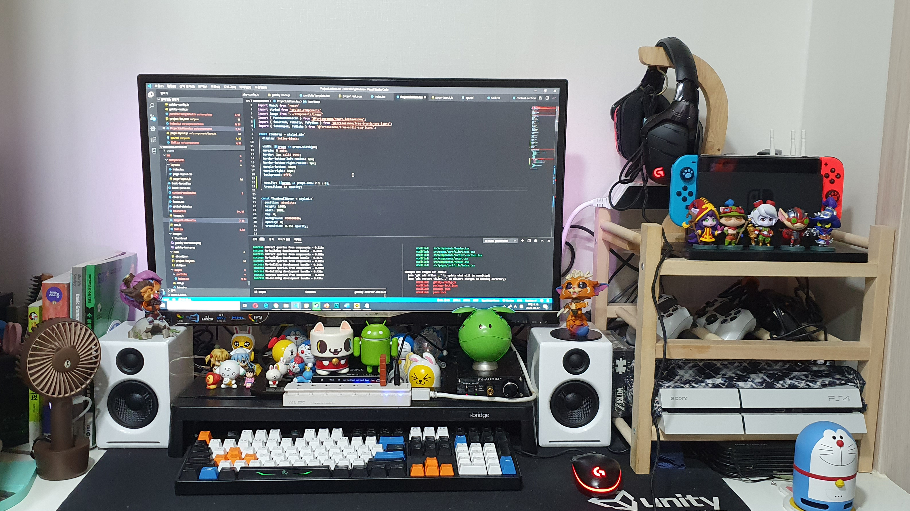

test, test, test, test, test, test, test, test, test, test, test, test, test, test, test, test, 
test, test, test, test, test, test, test, test, test, test, test, test, 
test, test, test, test, test, test, test, test, 
test, test, test, test, test, test, test, test, test, test, 
test, test.

```javascript
// In your gatsby-config.js
// Let's make this line very long so that our container has to scroll its overflow…
plugins: [
  {
    resolve: `gatsby-transformer-remark`,
    options: {
      plugins: [
        {
          resolve: `gatsby-remark-images`,
          options: {
            maxWidth: 756,
          },
        },
        {
          resolve: `gatsby-remark-responsive-iframe`,
          options: {
            wrapperStyle: `margin-bottom: 1.0725rem`,
          },
        },
        `gatsby-remark-copy-linked-files`,
        `gatsby-remark-smartypants`,
        `gatsby-remark-prismjs`,
      ]
    }
  }
]

```

```python
import os
import csv
import json
import enum

class ValueType(enum.Enum):
	NORMAL=0 
	ARRAY=1

infoArrayGroup = ['request']
visaArrayGroup = ['admissionSymbol']

# 그룹의 key의 value의 데이터 타입을 판단합니다.
def valueTypeCheck(groupKey, key):
  valueType = ValueType.NORMAL
  if groupKey == 'info':
    if key in infoArrayGroup:
      valueType = ValueType.ARRAY
  elif groupKey == 'visa':
    if key in visaArrayGroup:
      valueType = ValueType.ARRAY

  return valueType

def converter(fileName):
  exportData = {}
  with open(f'{fileName}.csv', "r", encoding="utf-8-sig", newline="") as csvFile:
    
    reader = csv.reader(csvFile)
    columns = next(reader)

    for groupKey in columns:
      if groupKey != '':
        exportData[groupKey] = {}

    for col in reader:
      index = 0
      while index < len(col):
        if len(col) <= index+1:
          index += 2
          continue
        groupKey = columns[index]
        key = col[index]
        value = col[index+1]

        if valueTypeCheck(groupKey, key) == ValueType.ARRAY:
          # array value check
          value = [arrayValue.strip() for arrayValue in value.split(',')]

        if key != '' and value !='':
          exportData[groupKey][key] = value
        index += 2

  with open(f'./json/{fileName}.json', 'w', encoding="utf-8-sig") as jsonFile:
    json.dump(exportData, jsonFile, ensure_ascii=False)
    print(f'[{fileName}] 민원인 json 변환완료')

os.makedirs('./json', exist_ok=True)

fileName = input('파일이름 입력 >> ')
print(f'[{fileName}] 민원인 csv 변환중')

converter(fileName)

```

```csharp
public class WarriorController : MonoBehaviour
{
    private Rigidbody2D test;
    
    void Start()
    {
        test = GetComponent<Rigidbody2D>();
    }

    void Update()
    {
        PlayerMove();
        PlayerJump();
    }
    
    void PlayerMove()
    {
        float  x = Input.GetAxis("Horizontal");
        transform.Translate(Vector3.right * (x * speed * Time.deltaTime));
    }
}


```




``` javascript

static void main () {
    minseok.a();
}

```